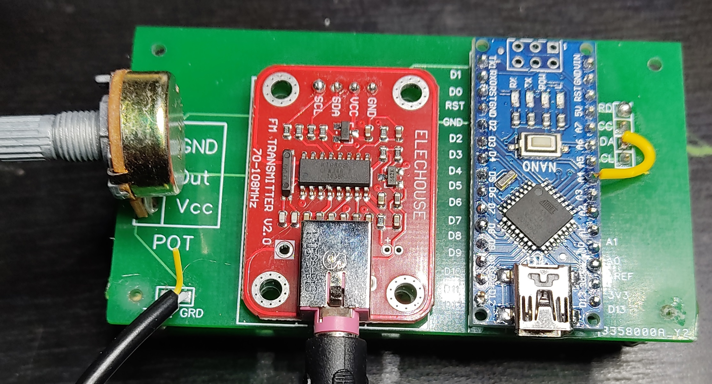
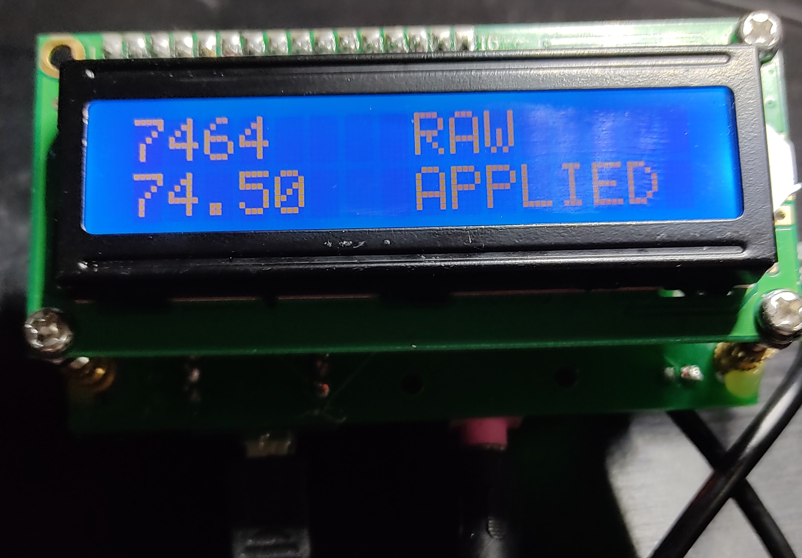

[back](../README.md)

### Project Name
FmTransmitter

### Description

Arduino used : NANO

Summary : Emit any signal from jack input to FM signal.
You can either emit sound/music from phone or directly from arduino (using tone function)

### Links

- Main logic : https://www.instructables.com/Build-Your-FM-transmission-Station-with-Arduino/
- Warning about FMTX library. It's a little old you have to custom it : https://forum.arduino.cc/index.php?topic=529831.0

### Remarks

- For using tone function from arduino, you have to solder a jack to the PCB (pin is 3D)
- FM signal range is 70 to 108 Mhz
- Potentiometer step is 0.5 Mhz 
- I created a gerber file save up space [here](other/FmTransmitter_PCB_v1.zip) (WARNING : there is a missing connection between A4 et SDA, check pictures below)

### Results

