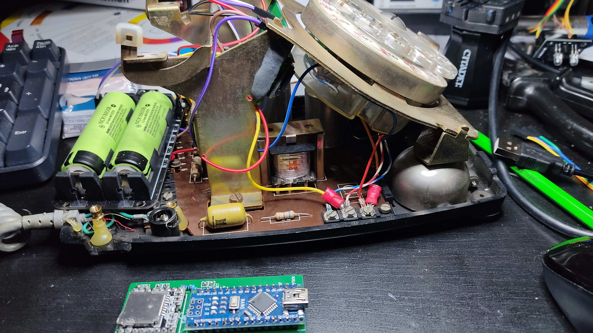

[back](../README.md)

### Project Name
RotaryPhone

### Description

Arduino used : NANO

Summary : Transform old rotary phone (Socotel) to an escape game device or jukebox.
Link each number to a MP3.

How to customize ? check all variables defined and update loop function.

### Links

- Main one is this one (in french): https://github.com/ThomasChappe/S63_Arduino (code and MP3 sounds took from this project)
- https://github.com/DFRobot/DFRobotDFPlayerMini

### Remarks

- Uses 115200 bauds channel as debug serial, 9600 is used by SD player module
- If you hand up the phone, current number resets and player stops
- I created a gerber file to help save up space in the phone [here](other/RotaryPhone_PCB_v1.zip)
- I decided to use 16650 batteries, I took a 2 batteries holder that uses USB-C connection (be careful about the version you choose. Mine cannot accept load AND charge at the same time).

### Results

Please note that the PCB outside the phone is another one for example. 
In the phone, the PCB is installed right behind the rotary device.

