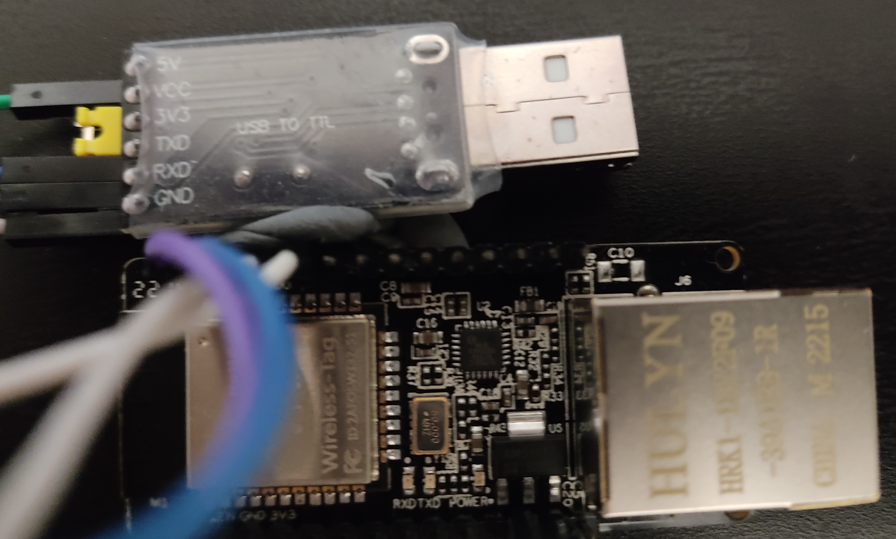

[back](../README.md)

### Project Name
POC about WT32-ETH01

### Description

Sum up information about that board.

I took this card because it contains both ethernet and Wi-Fi directly integrated.
Remark : we cannot use POE to power this board.

It doesn't have any USB kind port so to upload a program or debug we need to use an intermediate. In my case, it was a USB to TTL adaptor.

### Setup procedure with Arduino IDE

- Download Arduino IDE (I've read that v2 was not yet working for that case, but I didn't check myself)
- In Arduino IDE, open ``"File" > "Preferences"`` and add ``https://raw.githubusercontent.com/espressif/arduino-esp32/gh-pages/package_esp32_index.json`` in ``"Additional Boards Manager URLs:"``
(If you have many URLs to add, separate them by a comma)
- In ``"Tools" > "Board" > "Board Manager"`` search for ESP32 and install it
- Select the right kind of board, ``"ESP32 Dev module"`` will work for WT32-ETH01
- After selecting the board they are many options in ``"Tools"``, don't forget to increase the log level...

Now we have to handle the USB to TTL with WT32-ETH01 : 

| Board | USB to TTL |
|:-----:|:----------:|
|  5V   |     5V     |
 |  GRD  |    GRD     |
 |  RC0  |    TXD     |
|  TX0  |    RXD     |

You also have to connect : 
- VCC and 3V3 on the adaptor
- IO0 to GRD (the 2 pins that are neighbours) => enable the DEV mode (When you need to upload a program)

### Libraries

https://github.com/khoih-prog?tab=repositories&q=WT32&type=&language=&sort= contains many useful libraries about this board.
